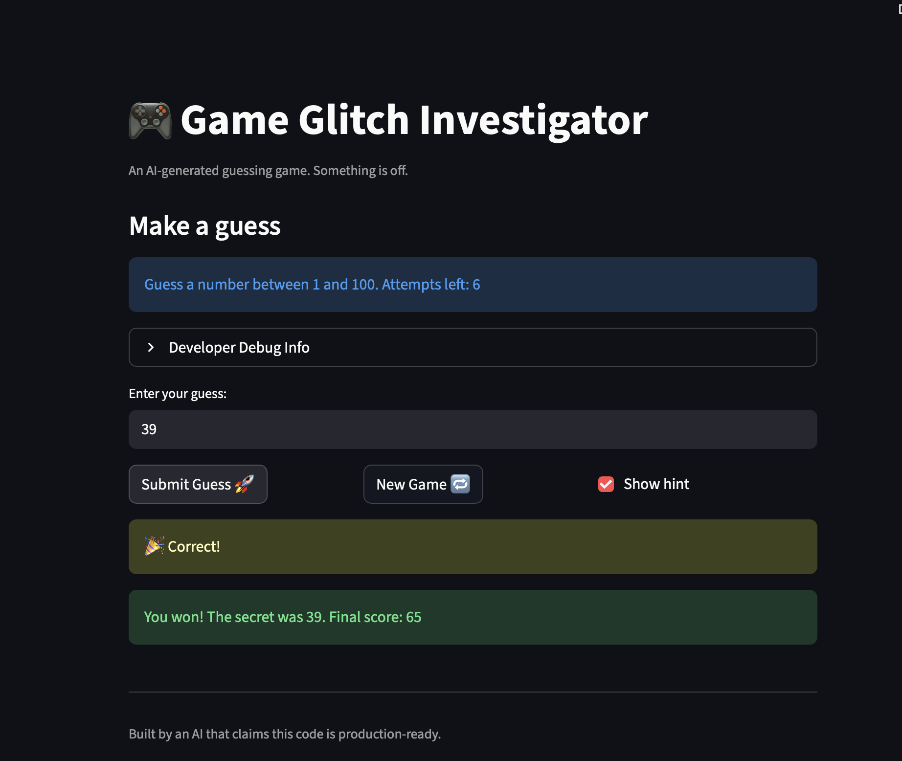

# 🎮 Game Glitch Investigator: The Impossible Guesser

## 🚨 The Situation

You asked an AI to build a simple "Number Guessing Game" using Streamlit.
It wrote the code, ran away, and now the game is unplayable. 

- You can't win.
- The hints lie to you.
- The secret number seems to have commitment issues.

## 🛠️ Setup

1. Install dependencies: `pip install -r requirements.txt`
2. Run the broken app: `python -m streamlit run app.py`

## 🕵️‍♂️ Your Mission

1. **Play the game.** Open the "Developer Debug Info" tab in the app to see the secret number. Try to win.
2. **Find the State Bug.** Why does the secret number change every time you click "Submit"? Ask ChatGPT: *"How do I keep a variable from resetting in Streamlit when I click a button?"*
3. **Fix the Logic.** The hints ("Higher/Lower") are wrong. Fix them.
4. **Refactor & Test.** - Move the logic into `logic_utils.py`.
   - Run `pytest` in your terminal.
   - Keep fixing until all tests pass!

## 📝 Document Your Experience

**Game purpose:** A number-guessing game where the player picks a difficulty, then tries to guess a secret number within a limited number of attempts. After each guess, the game gives a hint (Too High / Too Low) to help the player zero in on the answer.

**Bugs found:**

| # | Bug | Location |
|---|-----|----------|
| 1 | Hints were backwards — "Too High" said "Go HIGHER!" | `logic_utils.py` (`check_guess`) |
| 2 | Secret converted to a string on even attempts, making correct guesses fail | `app.py` (submit handler) |
| 3 | Score formula used `attempt_number + 1`, deducting 10 extra points per win | `logic_utils.py` (`update_score`) |
| 4 | Hard mode range was 1–50, easier than Normal's 1–100 | `logic_utils.py` (`get_range_for_difficulty`) |
| 5 | "New Game" used hardcoded `randint(1, 100)` regardless of difficulty | `app.py` (new game handler) |
| 6 | Info text always displayed "1 and 100" instead of the actual range | `app.py` |

**Fixes applied:**

- Swapped the hint messages in `check_guess` so each one directs the player toward the secret
- Removed the even/odd type-conversion block; `secret` is always the integer from session state
- Changed score formula from `100 - 10 * (attempt_number + 1)` to `100 - 10 * attempt_number`
- Changed Hard mode range to `(1, 1000)` so difficulty increases with each level
- Changed New Game to use `random.randint(low, high)` (difficulty-based variables)
- Changed info text to use `{low}` and `{high}` f-string variables
- Refactored all game logic (`get_range_for_difficulty`, `parse_guess`, `check_guess`, `update_score`) from `app.py` into `logic_utils.py`
- Added 8 new pytest cases in `tests/test_game_logic.py` — all 11 tests pass

## 📸 Demo

- [ ] [Insert a screenshot of your fixed, winning game here]

## 🚀 Stretch Features

- [ ] [If you choose to complete Challenge 4, insert a screenshot of your Enhanced Game UI here]
